# Recall — Autonomous Voice Request Recovery Agent

> **An AI-powered voice request recovery system that detects failed customer records, investigates the failure using an agentic workflow, retrieves relevant policy information, protects PII, and either autorecovers the request or routes it for human review.**

---

## Overview

**Recall** is an end-to-end AI engineering project built around a realistic operational problem:

> Customer requests captured from voice interactions can result in incomplete, invalid, or conflicting records.

Instead of sending every failed record directly to a human, Recall introduces an **autonomous recovery workflow**.

The system can:

* Capture customer requests through voice
* Convert speech to text
* Create structured request records
* Process records through PySpark
* Identify and prioritize failed records
* Investigate failures using an AI agent
* Retrieve relevant business policies using RAG
* Use MCP tools during investigation
* Protect sensitive information using Microsoft Presidio
* Apply NeMo Guardrails
* Validate recovery decisions deterministically
* Automatically recover eligible records
* Route ambiguous cases to human review
* Maintain record and recovery state
* Provide operational Streamlit interfaces

The project uses **local AI components where possible**, including Ollama/Qwen for LLM inference and local voice processing.

---

# Why Recall?

A conventional request-processing pipeline might look like:

```text
Voice
  ↓
Speech-to-Text
  ↓
Record
  ↓
Validation
  ↓
FAILED
  ↓
Human
```

This creates unnecessary manual work when some failures could be resolved automatically.

Recall adds an intelligent recovery layer:

```text
Voice
  ↓
Speech-to-Text
  ↓
Structured Record
  ↓
Validation
  ↓
Complete ───────────────→ Process normally
  │
  └── Failed / Conflicting
            ↓
      PySpark Processing
            ↓
      Prioritized Queue
            ↓
       Recovery Agent
            ↓
    ┌───────┴────────┐
    ↓                ↓
Recoverable       Uncertain
    ↓                ↓
Autorecover      Human Review
```

The goal is not to let the LLM make every decision.

Instead:

> **AI handles reasoning; deterministic logic handles correctness; humans handle unresolved ambiguity.**

---

# Key Features

### 🎙️ Voice AI

* Microphone-based interaction
* Faster-Whisper speech-to-text
* Local Qwen inference through Ollama
* Piper text-to-speech
* End-to-end conversational workflow

### 🤖 Agentic Recovery

* LangGraph-based orchestration
* Stateful recovery workflow
* Failure investigation
* Tool usage
* Policy retrieval
* Recovery decision
* Human escalation

### 🔌 MCP

* Model Context Protocol
* Controlled access to application tools
* Separation between agent reasoning and tool implementation

### 📚 RAG

* Chroma vector database
* Sentence Transformer embeddings
* Policy retrieval
* Relevant business rules supplied to the recovery agent

### 🛡️ PII Protection

* Microsoft Presidio Analyzer
* Microsoft Presidio Anonymizer
* Custom `POLICY_NUMBER` recognizer
* PII-aware processing before unnecessary LLM exposure

### ⚡ Data Processing

* PySpark batch processing
* Failed-record prioritization
* Recovery queue

### 👤 Human-in-the-Loop

* Human review queue
* Escalation for ambiguous cases
* No forced AI decision when sufficient evidence is unavailable

### 🖥️ Operational Interfaces

Two Streamlit applications:

* Voice Operations Console
* Recovery Operations Console

### 📝 Auditability

The workflow maintains persistent records showing:

* Original request
* Processing state
* Failure state
* Recovery investigation
* Recovery result
* Human-review state
* Autorecovery state

---

# Architecture

```text
                         ┌─────────────────────┐
                         │   Customer Voice     │
                         └──────────┬──────────┘
                                    │
                                    ▼
                         ┌─────────────────────┐
                         │   Faster-Whisper    │
                         │     Speech → Text   │
                         └──────────┬──────────┘
                                    │
                                    ▼
                         ┌─────────────────────┐
                         │    PII Protection   │
                         │      Presidio       │
                         └──────────┬──────────┘
                                    │
                                    ▼
                         ┌─────────────────────┐
                         │    Structured       │
                         │      Record         │
                         └──────────┬──────────┘
                                    │
                                    ▼
                         ┌─────────────────────┐
                         │     PySpark         │
                         │ Batch Processing    │
                         └──────────┬──────────┘
                                    │
                           Failed / Conflicting
                                    │
                                    ▼
                         ┌─────────────────────┐
                         │ Prioritized Queue   │
                         └──────────┬──────────┘
                                    │
                                    ▼
                         ┌─────────────────────┐
                         │    LangGraph        │
                         │  Recovery Agent     │
                         └──────┬──────┬───────┘
                                │      │
                    ┌───────────┘      └────────────┐
                    ▼                               ▼
             ┌─────────────┐                ┌─────────────┐
             │     MCP     │                │  RAG /      │
             │    Tools    │                │   Chroma    │
             └──────┬──────┘                └──────┬──────┘
                    │                              │
                    └──────────────┬───────────────┘
                                   ▼
                         ┌─────────────────────┐
                         │    Qwen / Ollama    │
                         │    Local LLM        │
                         └──────────┬──────────┘
                                    │
                                    ▼
                         ┌─────────────────────┐
                         │ Deterministic       │
                         │ Validation          │
                         └──────────┬──────────┘
                                    │
                         ┌──────────┴──────────┐
                         ▼                     ▼
                   AUTORECOVERED          HUMAN REVIEW
                         │                     │
                         └──────────┬──────────┘
                                    ▼
                         ┌─────────────────────┐
                         │ Persistent Records  │
                         │ + Audit State       │
                         └─────────────────────┘
```

---

# End-to-End Workflow

## 1. Voice Conversation

The workflow begins with the customer speaking through the Voice AI interface.

The system:

```text
Voice
  ↓
Faster-Whisper
  ↓
Transcript
  ↓
Request Understanding
  ↓
Structured Record
```

### Evidence

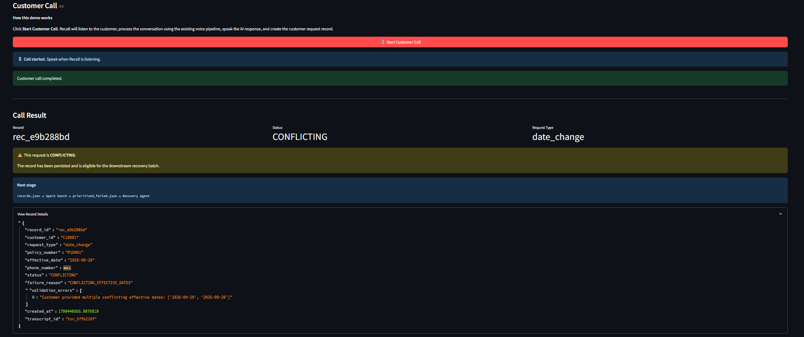

The Voice Operations interface demonstrates the conversational layer and creation of the corresponding request record.

---

# 2. PySpark Processing

Records are processed through a PySpark batch workflow.

```text
Records
   ↓
PySpark
   ↓
Validation / Processing
   ↓
Failed Records
```

### Evidence

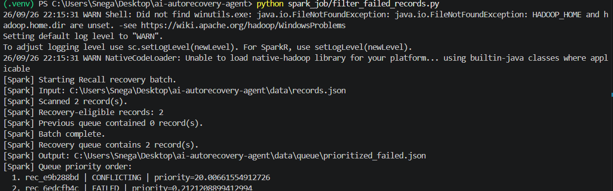

The project uses Spark as a batch-processing layer rather than invoking the recovery agent independently for every record.

---

# 3. Failed Record Prioritization

Records requiring recovery are placed into a prioritized queue.

```text
data/queue/prioritized_failed.json
```

### Evidence

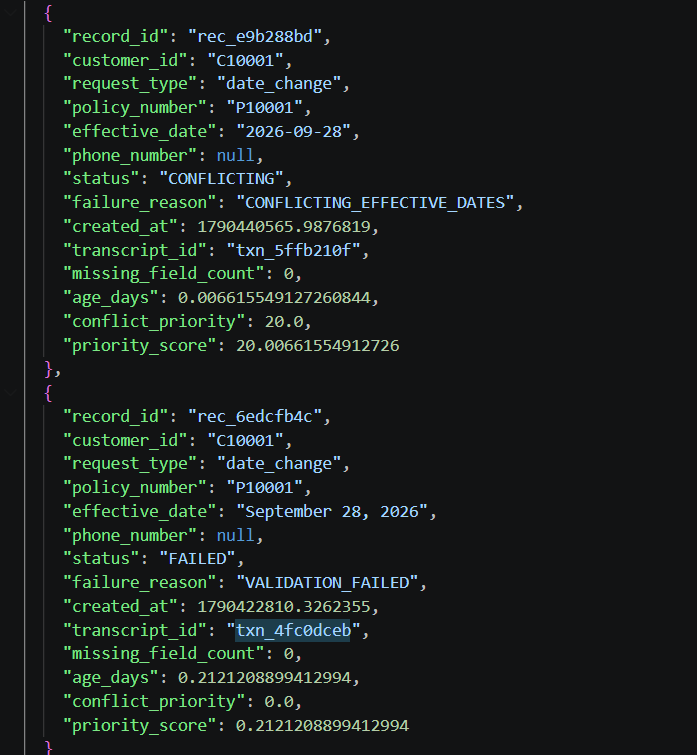

This creates a clear boundary between the data-processing layer and the AI recovery layer.

---

# 4. Persistent Records

The original structured records are maintained in `records.json`.

### Evidence

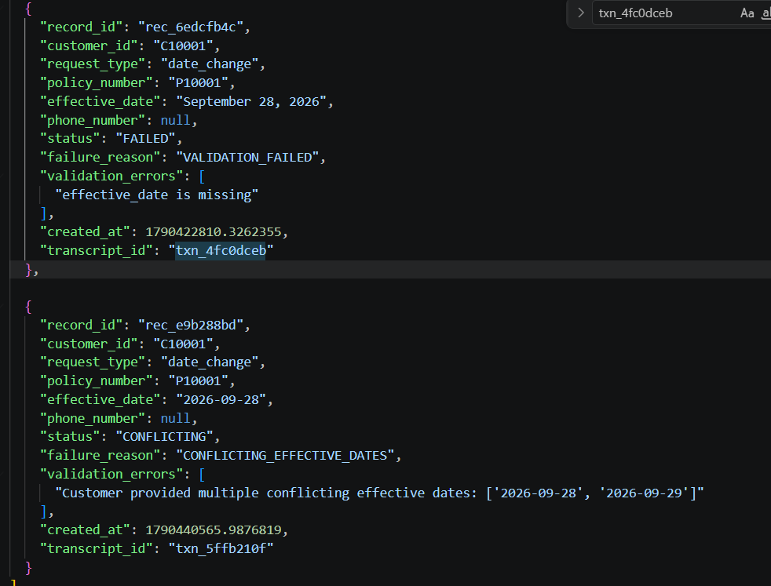

The record state can progress through different processing stages rather than existing only as an LLM response.

---

# 5. Recovery Operations UI

The Recovery Operations interface provides visibility into records requiring recovery.

When there are no pending records, the application displays an explicit empty state.

### Evidence

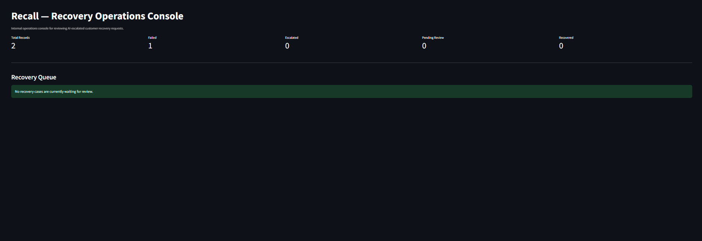

This demonstrates that the UI reflects the actual recovery queue.

---

# 6. Human Review UI

The human-review interface also handles the case where no record is currently waiting for intervention.

### Evidence

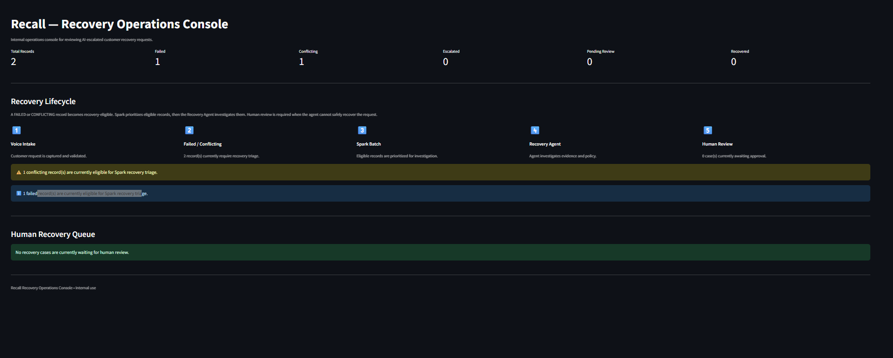

Human review is only introduced when the recovery workflow determines that autonomous recovery should not proceed.

---

# 7. Autonomous Agent Investigation

When a failed record enters the recovery workflow, the LangGraph agent investigates the failure.

The investigation can involve:

1. Inspecting the failed record
2. Identifying missing or invalid information
3. Calling MCP tools
4. Retrieving relevant policy through RAG
5. Reasoning with the local LLM
6. Validating the proposed recovery
7. Deciding whether to recover or escalate

### Evidence

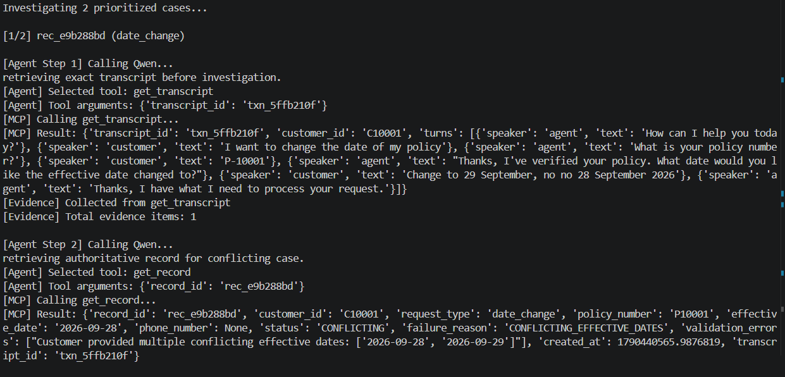

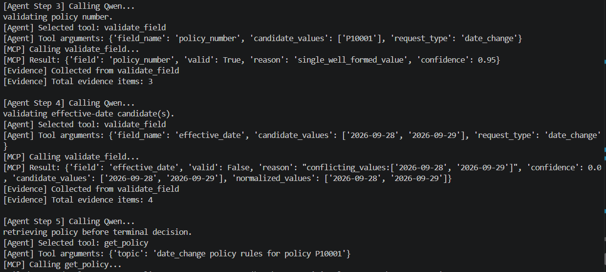

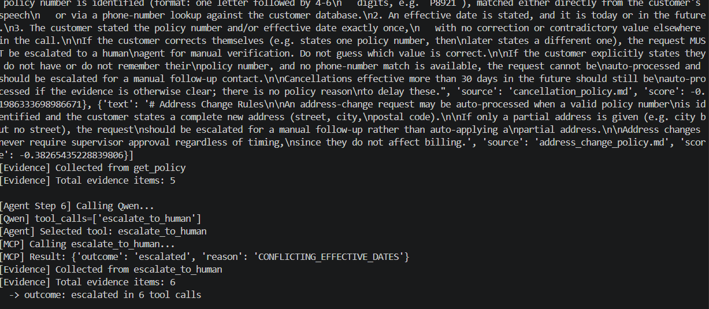

---

# 8. LLM Failure Handling

The recovery system also handles unsuccessful investigation attempts.

### Evidence

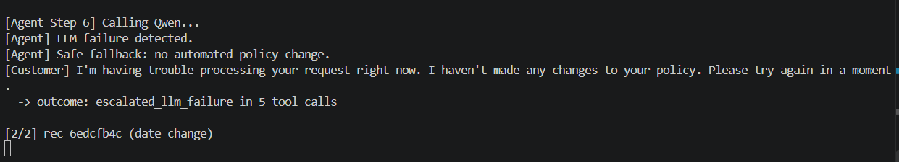

A failed LLM/recovery attempt does not automatically become a successful recovery.

This keeps the final record state aligned with the actual outcome.

---

# 9. Record State Update

After the recovery workflow completes, the persistent record is updated.

### Evidence

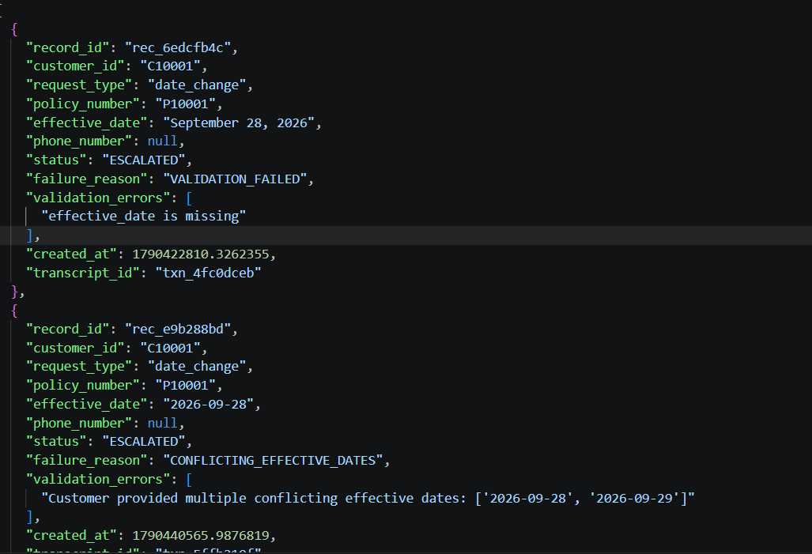

This demonstrates that the agent is connected to the application's state rather than operating as an isolated chatbot.

---

# 10. Human Review Queue

Cases that cannot safely be recovered automatically can be placed into the human-review queue.

### Evidence

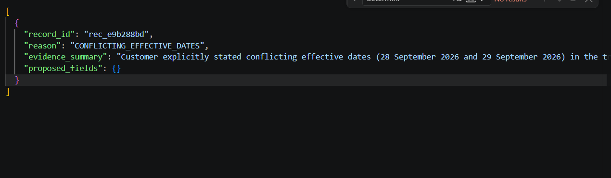

The recovery decision follows:

```text
                 Agent Investigation
                         │
                         ▼
               Sufficient evidence?
                  /             \
                YES              NO
                 │                │
                 ▼                ▼
             Recover          Human Review
```

Examples of reasons for escalation include:

* Conflicting information
* Policy restrictions
* Approval-required operations
* Unsuccessful recovery investigation

* ### Demo

https://github.com/user-attachments/assets/9ea454e5-536f-4ce9-abb6-e7d540052f79

---

# 11. Successful Autorecovery

The following execution demonstrates a Agent recovery investigation.

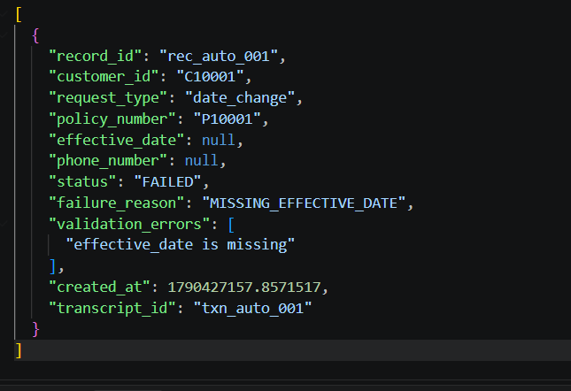

### Evidence

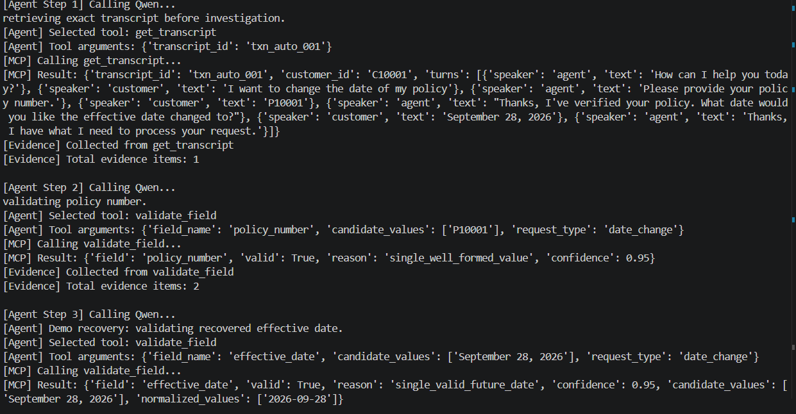

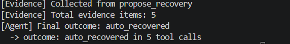

---

# 12. Successful Autorecovery

After the recovery workflow obtains sufficient information and passes the required validation, the record can be automatically recovered.

### Evidence

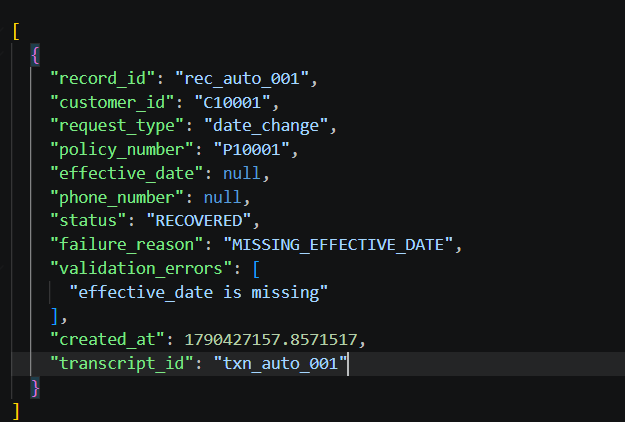

The demonstrated state transition is:

```text
FAILED
  ↓
AGENT INVESTIGATION
  ↓
RECOVERY
  ↓
VALIDATION
  ↓
AUTORECOVERED
```

---

# Agent Architecture

The recovery agent is implemented using **LangGraph**.

Rather than using a single LLM prompt, the recovery process is represented as a workflow.

```text
Failed Record
      ↓
Analyze Failure
      ↓
Identify Missing Information
      ↓
Retrieve Relevant Policy
      ↓
MCP Tool Calls
      ↓
LLM Reasoning
      ↓
Deterministic Validation
      ↓
Decision
   ┌──┴────┐
   ↓       ↓
Recover  Escalate
```

This makes the workflow explicit and easier to extend with additional tools, validation stages, retries, and human approval.

---

# MCP Tooling

Recall uses **Model Context Protocol (MCP)** to expose controlled tools to the agent.

The agent does not directly access internal application functionality.

Instead:

```text
LangGraph Agent
      ↓
     MCP
      ↓
Controlled Tools
      ↓
Application Data / Operations
```

This separates:

* Agent reasoning
* Tool implementation
* Application data
* Business operations

---

# Retrieval-Augmented Generation

The recovery agent uses RAG when policy information is required.

The pipeline is:

```text
Policy Documents
      ↓
Chunking
      ↓
Sentence Transformer Embeddings
      ↓
Chroma Vector Store
      ↓
Relevant Policy Retrieval
      ↓
Agent Context
      ↓
Qwen
```

This allows business policies to remain external to the LLM's general knowledge.

For example, the project models policy-dependent recovery scenarios such as:

* cancellation requiring a policy number or verified phone match
* restricted date changes requiring supervisor approval

The agent therefore reasons over **retrieved business evidence**, rather than relying exclusively on its pretrained knowledge.

---

# PII Protection with Microsoft Presidio

Recall uses **Microsoft Presidio** for PII detection and anonymization.

The PII layer contains:

* Presidio Analyzer
* Presidio Anonymizer
* Custom domain-specific recognizers

A custom recognizer is used for the project's `POLICY_NUMBER` entity.

This is important because domain-specific identifiers cannot always be correctly identified by generic PII recognizers.

The processing flow is:

```text
Raw Transcript
      ↓
Presidio Analyzer
      ↓
Built-in + Custom Recognizers
      ↓
PII Detection
      ↓
Anonymization
      ↓
Sanitized AI Processing
```

---

# Voice AI Architecture

Recall provides a complete local voice pipeline:

```text
Microphone
    ↓
Faster-Whisper
    ↓
Transcript
    ↓
LangGraph Agent
    ↓
Qwen / Ollama
    ↓
Response
    ↓
Piper TTS
    ↓
Audio
```

### Speech-to-Text

**Faster-Whisper** is used for local transcription.

### LLM

**Qwen** runs locally through **Ollama**.

### Text-to-Speech

**Piper** generates the local voice response.

This avoids requiring a paid cloud voice API for the core voice workflow.

---

# Human-in-the-Loop

Recall does not attempt to autonomously resolve every request.

When the evidence is insufficient or the operation requires approval, the system routes the record to human review.

```text
AI Investigation
      ↓
Can it safely recover?
      │
 ┌────┴────┐
 ↓         ↓
YES        NO
 ↓         ↓
Recover   Human Review
```

This provides a controlled boundary between automation and human decision-making.

---

# Data Processing Pipeline

The data-processing side of Recall follows:

```text
records.json
     ↓
PySpark
     ↓
Validation
     ↓
Failed / Conflicting Records
     ↓
Prioritization
     ↓
prioritized_failed.json
     ↓
Recovery Agent
```

The separation allows the system to treat AI recovery as a downstream operational process rather than mixing data ingestion and LLM reasoning together.

---

# Operational Interfaces

Recall contains two Streamlit interfaces.

## Voice Operations

```text
ui/voice_console/app.py
```

Used for the voice interaction and request creation workflow.

Example startup:

```bash
streamlit run ui/voice_console/app.py --server.port 8501
```

## Recovery Operations

```text
ui/recovery_console/app.py
```

Used for monitoring recovery records and human-review workflows.

Example startup:

```bash
streamlit run ui/recovery_console/app.py --server.port 8502
```

---

# API

The backend also provides a FastAPI application.

```text
api/main.py
```

Run with:

```bash
uvicorn api.main:app --reload
```

The API provides the application/backend boundary used by the surrounding workflow.

---

The resulting workflow allows the system to:

Understand a customer request → create a structured record → identify failures → investigate them with an AI agent → retrieve relevant policy → protect sensitive information → validate the proposed recovery → automatically recover eligible requests → or route unresolved cases to a human.
